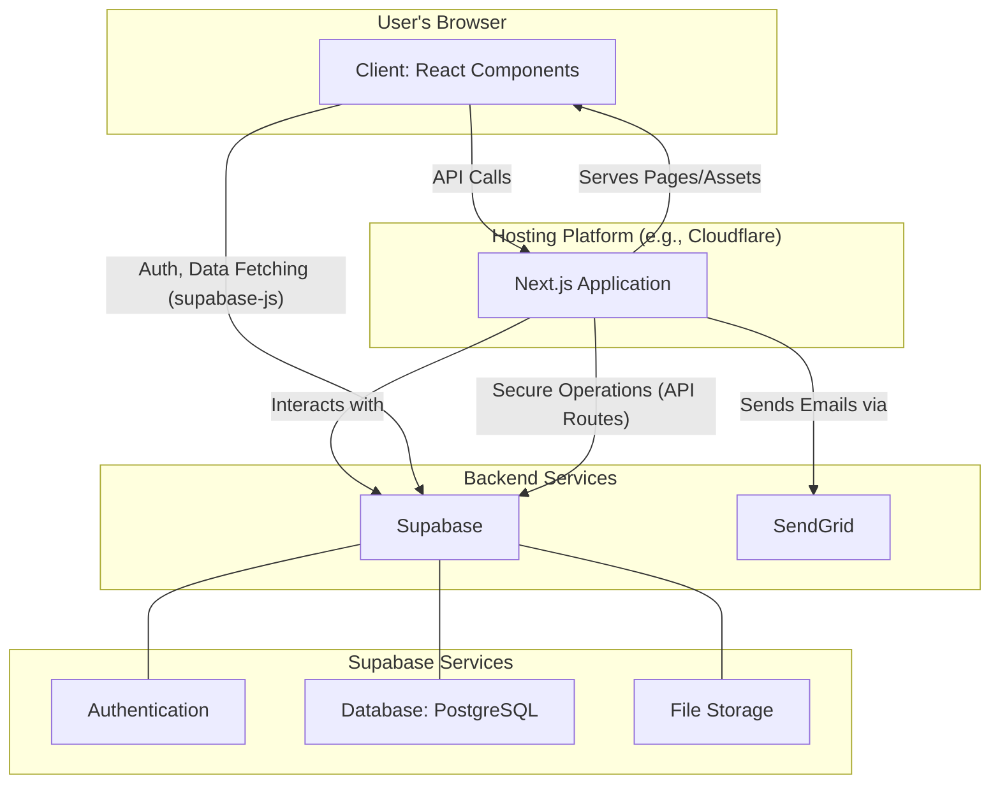
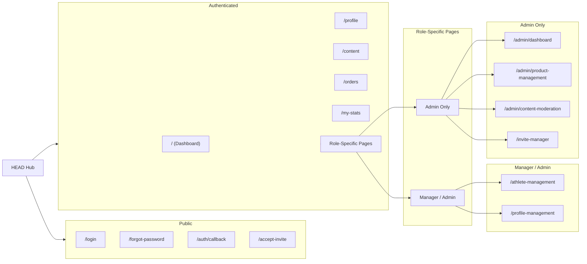

# HEAD Hub - Athlete & Equipment Management Platform


**HEAD Hub** is a comprehensive, role-based web application designed to streamline equipment orders, content management, and team coordination for HEAD's athletes, managers, and administrators. Built with a modern, robust technology stack, it provides a centralized platform for all operational needs.

---

## 🌟 Key Features

-   **Authentication:** Secure login system with email/password, password recovery, and role-based access.
-   **Role-Based Access Control (RBAC):**
    -   **Admin:** Full control over users, products, orders, content, and invitations.
    -   **Manager:** Manages assigned athletes, approves orders, and oversees content.
    -   **Athlete:** Can place equipment orders, upload content, and view personal stats.
-   **Product & Equipment Management:**
    -   Admins can manage product catalogs across various categories (snowboards, bindings, etc.).
    -   Dynamic product browsing and filtering.
-   **Order Management System:**
    -   Athletes can create and submit orders for equipment.
    -   Multi-step approval workflow (Manager/Admin).
    -   Real-time order status tracking.
-   **Content Management:**
    -   Athletes can upload images and videos to a centralized gallery.
    -   Admins can moderate and manage all uploaded content.
-   **Invitation System:** Admins can invite new managers and athletes to the platform via email.
-   **User & Profile Management:** Users can manage their own profiles; Admins can manage all user profiles.
-   **Analytics Dashboard:** Visual statistics on orders, content, and user activity.

---

## 🛠️ Technology Stack

-   **Framework:** [Next.js 15](https://nextjs.org/) (with App Router)
-   **Language:** [TypeScript](https://www.typescriptlang.org/)
-   **UI Library:** [React 19](https://react.dev/)
-   **Styling:** [Tailwind CSS](https://tailwindcss.com/)
-   **Backend-as-a-Service (BaaS):** [Supabase](https://supabase.io/)
    -   **Database:** PostgreSQL
    -   **Authentication:** Supabase Auth
    -   **Storage:** Supabase Storage for file uploads
-   **Email Service:** [SendGrid](https://sendgrid.com/) for transactional emails (invitations, password resets).
-   **Deployment Target:** [Cloudflare Pages](https://pages.cloudflare.com/)

---

## 🚀 Getting Started

Follow these instructions to get the project running locally for development and testing.

### Prerequisites

-   [Node.js](https://nodejs.org/en/) (v18.x or later)
-   [npm](https://www.npmjs.com/) (v9.x or later)
-   A [Supabase](https://supabase.io/) account to create a project.
-   A [SendGrid](https://sendgrid.com/) account for sending emails.

### 1. Clone the Repository

```bash
git clone <your-repository-url>
cd HEAD-Hub
```

### 2. Set Up Environment Variables

The application is configured using environment variables.

1.  Navigate to the Next.js application directory:
    ```bash
    cd app
    ```
2.  Create a local environment file by copying the example:
    ```bash
    cp env.example .env.local
    ```
3.  Open `.env.local` and fill in the required credentials. **This is a critical step.**

    -   `NEXT_PUBLIC_SUPABASE_URL`: Found in your Supabase project's *Settings > API*.
    -   `NEXT_PUBLIC_SUPABASE_ANON_KEY`: The `anon` `public` key from your Supabase project's API settings.
    -   `SUPABASE_SERVICE_ROLE_KEY`: The `service_role` `secret` key from your Supabase project's API settings.
    -   `SENDGRID_API_KEY`: Your API key from SendGrid.

### 3. Install Dependencies

Install the necessary Node.js packages.

```bash
npm install
```

### 4. Set Up Supabase Database

You need to run the SQL scripts located in the `/sql` directory of the root project folder in your Supabase project's SQL Editor to create the necessary tables (`profiles`, `products`, `orders`, etc.).

### 5. Run the Development Server

Once the setup is complete, you can start the local development server.

```bash
npm run dev
```

The application should now be running at [http://localhost:3000](http://localhost:3000).

---

## 📜 Available Scripts

All scripts should be run from within the `app/` directory.

-   `npm run dev`: Starts the Next.js development server.
-   `npm run build`: Creates an optimized production build of the application.
-   `npm run start`: Starts the application in production mode (requires `npm run build` first).
-   `npm run lint`: Runs ESLint to check for code quality and style issues.

---

## 🏗️ Project Structure

The core logic of the application resides within the `app/src` directory.

```
app/
└── src/
    ├── app/                # Next.js App Router: Pages and API routes
    │   ├── (admin)/        # Route group for admin-only pages
    │   ├── api/            # API endpoint handlers
    │   └── ...             # Other pages like /login, /content, etc.
    ├── components/         # Reusable React components (e.g., Sidebar, Modals)
    ├── contexts/           # Global state management (e.g., AuthContext)
    ├── hooks/              # Custom React hooks
    ├── lib/                # Libraries and helper functions (e.g., Supabase clients)
    └── middleware.ts       # Handles authentication and route protection
```

---

## 🏛️ Application Architecture

The application is built on a modern Jamstack architecture, leveraging Next.js for both frontend and backend capabilities, with Supabase providing the core backend services.



1.  **Client-Side (Browser):** The user interacts with the React application built with Next.js. The client-side code communicates directly with Supabase for authentication and real-time data fetching.
2.  **Next.js Application:** Serves the static assets and handles server-side logic via API Routes. These API routes perform secure operations, such as interacting with the Supabase database with admin privileges or sending emails via SendGrid.
3.  **Supabase:** Acts as the primary backend, providing authentication, a PostgreSQL database, and file storage.
4.  **SendGrid:** Integrated via API routes to handle all transactional emails.

---

## 🗺️ Page & Routing Structure

The application uses a role-based routing system to control access to different pages. Routes are protected by the `middleware.ts` file.



---

## 📄 Pages — Complete List

Public:
- `/login`
- `/forgot-password`
- `/auth/callback`
- `/accept-invite`

Authenticated:
- `/` (Dashboard)
- `/profile`
- `/content`
- `/content/upload`
- `/orders`
- `/orders/pending`
- `/my-stats`
- `/analytics`
- `/onboarding`

Manager/Admin:
- `/profile-management`
- `/athlete-management`

Admin Only:
- `/admin/dashboard`
- `/admin/product-management`
- `/admin/content-moderation`
- `/admin/audit-logs`
- `/invite-manager`
- `/signup`

Note: Access is enforced by `middleware.ts` and `ProtectedRoute`.

---

## 🔌 API Endpoints — Complete List

Admin:
- `GET/POST /api/admin/audit-logs`
- `GET /api/admin/check-email`
- `POST /api/admin/backup`
- `GET /api/admin/dashboard`
- `POST /api/admin/delete-user`
- `POST /api/admin/send-magic-link`
- `POST /api/admin/send-recovery-link`
- `POST /api/admin/set-password`
- `GET/POST /api/admin/settings`
- `GET /api/admin/products`
- `GET /api/admin/products-debug`
- `GET /api/admin/products-temp`

Analytics:
- `GET /api/analytics/athlete-products`
- `GET /api/analytics/athlete-stats`
- `GET /api/analytics/athlete-stats-simple`
- `GET /api/analytics/content`
- `GET /api/analytics/content-simple`
- `GET /api/analytics/my-stats`
- `GET /api/analytics/orders`
- `GET /api/analytics/orders-simple`

Content:
- `GET /api/content/count`
- `GET /api/content/download`
- `GET /api/content/files`
- `GET /api/content/gallery`
- `GET /api/content/health`
- `GET /api/content/sessions`

Equipment:
- `GET /api/equipment`
- `GET /api/equipment/[id]`
- `GET /api/equipment/categories`

Invitations (new flow):
- `POST /api/invitations/send`
- `POST /api/invitations/register`
- `POST /api/invitations/accept`
- `GET /api/invitations/validate`
- `GET /api/invitations/stats`

Invites (legacy compatibility):
- `GET/POST /api/invites`
- `POST /api/invites/accept`
- `GET /api/invites/validate`

Orders:
- `GET/POST /api/orders`
- `GET /api/orders/pending`
- `POST /api/orders/approve`
- `POST /api/send-order`

Profiles:
- `POST /api/profiles/create`
- `GET /api/profiles/list`
- `POST /api/profiles/update`

Notifications & Uploads:
- `GET/POST /api/notifications`
- `POST /api/uploads/presign`

Health/Infra:
- `GET /api/health`
- `GET /api/metrics`
- `GET /api/ready`

---

## 🔐 Authentication & Middleware Overview

- **Auth Provider:** Supabase Auth (email/password, recovery links)
- **Client SDK:** `@supabase/supabase-js` initialized in `app/src/lib/supabase-client.ts`
- **Server SDK:** RLS-aware server client via cookies in `app/src/lib/supabase-server.ts`
- **Cookies consideradas por el middleware:**
  - `sb-access-token`
  - `sb:token`
  - `supabase-auth-token` (array `[access, refresh]`, parseado en middleware)
- **Middleware (`app/src/middleware.ts`)**
  - Public routes: `/`, `/login`, `/login/`, `/accept-invite`, `/auth/callback`
  - Protected prefixes: `/profile`, `/profile-management`, `/athlete-management`, `/invite-manager`, `/content`, `/orders`, `/analytics`, `/my-stats`, `/admin`
  - Matcher: `/(?!api|_next/static|_next/image|favicon.ico).*`
- **ProtectedRoute (`app/src/components/ProtectedRoute.tsx`)**
  - Espera a `hydrated=true` (desde `AuthContext`) para evitar redirecciones prematuras
  - Comprueba rol cuando se especifica `requiredRole`

---

## ⚙️ Environment Variables

Supabase:
- `NEXT_PUBLIC_SUPABASE_URL`
- `NEXT_PUBLIC_SUPABASE_ANON_KEY`
- `SUPABASE_SERVICE_ROLE_KEY`

App:
- `NEXT_PUBLIC_APP_URL` (e.g., `http://localhost:3000`)
- `NEXT_PUBLIC_BRAND_NAME`
- `NEXT_PUBLIC_LOGO_PATH`
- `NEXT_PUBLIC_UPLOADS_BUCKET`

Admin (bootstrap/local only):
- `ADMIN_EMAIL`
- `ADMIN_PASSWORD`

Security / NextAuth (if applicable):
- `NEXTAUTH_SECRET`
- `NEXTAUTH_URL`

Email / SendGrid:
- `SENDGRID_API_KEY`
- `SENDGRID_FROM_EMAIL`
- `FROM_NAME`

Other:
- `RATE_LIMIT_WINDOW_MS`, `RATE_LIMIT_MAX_REQUESTS`
- `CONTENT_MODERATION_ENABLED`, `CONTENT_MODERATION_API_KEY`
- `BACKUP_ENABLED`, `BACKUP_SCHEDULE`
- `NOTIFICATIONS_ENABLED`, `NOTIFICATIONS_EMAIL_ENABLED`

Notes:
- Nunca commitees claves reales. Usa `.env.local` (git-ignored).
- Revisa Supabase: Settings → API para obtener URL/keys.

---

## 👤 Roles & Access Matrix (Resumen)

- **Athlete:** `/`, `/profile`, `/content`, `/orders`, `/my-stats`
- **Manager:** Athlete + `/athlete-management`, `/profile-management`
- **Admin:** Manager + `/admin/*`, `/invite-manager`, `/signup`

El control final de acceso a datos se garantiza mediante RLS en Supabase.

---

## 🚢 Deployment Notes

- **Production build:** `npm run build` (Next.js 15)
- **Runtime:** Uses Node SSR (Next App Router). Ensure environment variables are available at runtime.
- **Docker (example):** Build a production image from `app/` using `next start` with proper env injection.
- **Cloudflare Pages:** Deploy following Cloudflare’s Next.js SSR guide. Provide env vars in Pages/Workers settings.

---

## 🧰 Troubleshooting

- Login loop: Verifica que las cookies de Supabase existan (`sb-access-token`). Asegúrate de acceder desde `http://localhost:3000` (mismo origen que `NEXT_PUBLIC_APP_URL`).
- Recovery flow: El correo debe apuntar a `/auth/callback` con `type=recovery` en el hash; la vista mostrará el formulario para nueva contraseña.
- 404 en rutas protegidas: Comprueba `middleware.ts` y el prefijo; revisa también `ProtectedRoute` y `hydrated` en `AuthContext`.

# Project Setup

## Setup Instructions
1. Clone the repository.
2. Run `npm install` to install dependencies.
3. Copy `.env.example` to `.env` and fill in the required environment variables.
4. Run `npm run dev` to start the development server.

## Scripts
- `npm run dev`: Start the development server.
- `npm run build`: Build the project for production.
- `npm run start`: Start the production server.
- `npm run lint`: Run ESLint.
- `npm run typecheck`: Run TypeScript type checking.
- `npm run test`: Run tests using Vitest.
- `npm run format`: Format code using Prettier.
- `npm run check`: Run lint, typecheck, test, and build.

## Environment Variables
Refer to `.env.example` for the required environment variables.

## CI/CD
- GitHub Actions are used for continuous integration and deployment.
- On each push to the main branch, the CI workflow runs linting, type checking, tests, and builds the project.
- Deployment to Cloudflare Pages is triggered after a successful build.

## Restoring from .trash/
If any files were moved to `.trash/`, you can restore them by moving them back to their original locations.

